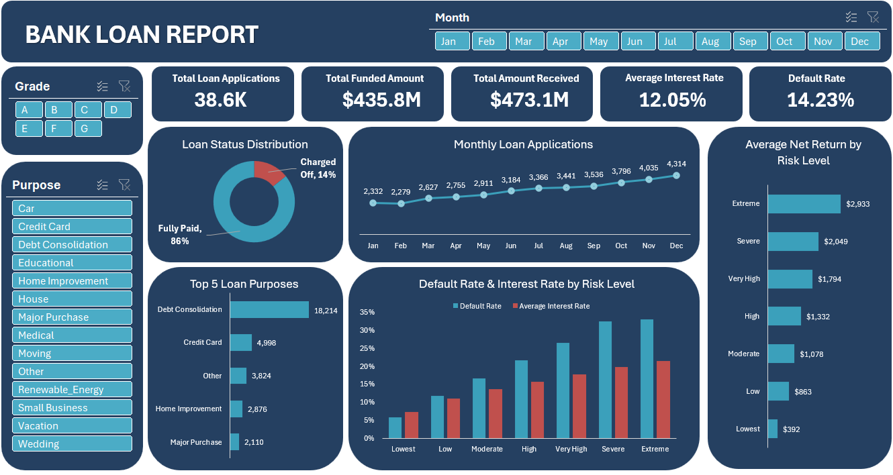

# Bank Loan Analysis
## Table of Contents

- [Project Overview](#project-overview)
- [Dataset](#dataset)
- [Tools](#tools)
- [Dashboard Page](#dashboard-page)
- [Data Cleaning & Transformation](#data-cleaning-and-transformation)
- [Key Insights](#key-insights)
- [Business Recommendations](#business-recommendations)

## Project Overview
This project analyzes a bank loan dataset containing 38,576 loan applications issued in 2021 using Microsoft Excel.

**The dashboard focuses on:**
- Loan applications trends over time
- Interest rate patterns across risk groups
- Loan portfolio quality and default rates
- Risk segmentation analysis
- Main loan purposes
- Average net return by risk level

 ## Dataset
The dataset was sourced from a public [YouTube tutotial project](https://www.youtube.com/watch?v=yzaLl-BvHnc&list=PLO9LeSU_vHCWWRghKgAQRg_TrgtRl5-4Y&index=11&t=69s)
The dashboard design, data preparation, calculations, and analysis were created independently.
## Tools
- Excel
- Power Query
- Pivot Tables
- DAX

## Dashboard Page

## Data Cleaning and Transformation
Before the analysis, the raw data was cleaned and transformed using Power Query.
The process included:
- Text normalization, such as trimming whitespace, standardizing capitalization, and correcting minor formatting inconsistencies
- Removing unnecessary columns
- Created a Date Table for time-based analysis
- Removing duplicates
- For analyses related to loan outcomes and loan status distribution, loans with the status Current were excluded because they are still active and their final repayment outcome cannot yet be determined.

## Key insights
- Charged-off loans accounted for 14.23% of all completed loans.
- Debt consolidation was the most common loan purpose, accounting for more than half of all applications.
- Loan applications increased steadily throughout the year.
- Default rates increased consistently across risk levels.
- Higher-risk borrowers were charged higher average interest rates.
- Higher-risk loans generated higher average net returns but also experienced significantly higher default rates.

## Business Recommendations

- Continue monitoring high-risk segments, as they generate higher returns but also significantly higher default rates.
- Consider tighter approval criteria for Extreme and Severe risk groups.
- Focus marketing efforts on debt consolidation products, which represent the largest share of applications.
- Monitor changes in application volume over time to identify emerging demand trends.
